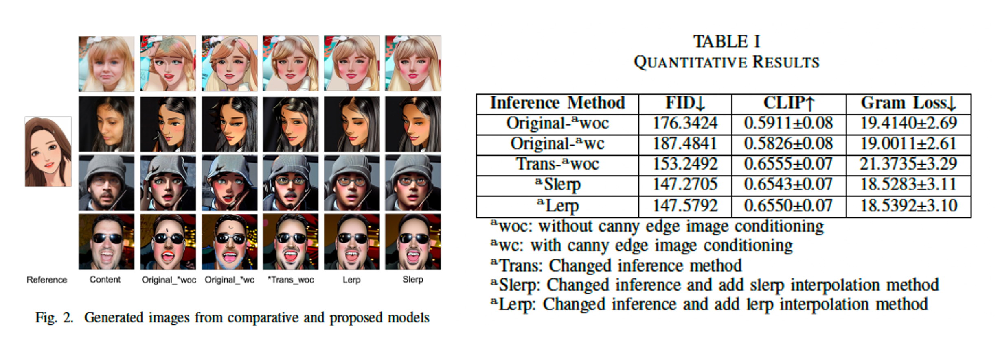

# Webtoon_InST

### Preview of the Demo


- Image-to-Image Translation 데모 영상 [Video](https://youtu.be/4-QMtaXoLyc?si=MmDpkumInI8QuE6j)
- Text-to-Image Generation 안내 영상 [Video](https://youtu.be/pdjXOimKhbk?si=CJflk50u4HBIKWa9)
- Text-to-Image Generation 데모 영상 [Video](https://youtu.be/GM8euTbBVh8?si=ThZpmWPVRLfiu6fp)

## Getting Started

We recommend running our code using:

- NVIDIA GPU + CUDA, CuDNN
- Python 3, Anaconda

<p align="right">(<a href="#top">back to top</a>)</p>

---

### 1. Installation

Clone the repositories.
   ```sh
   git clone https://github.com/ssoojeong/Webtoon_InST.git
   git clone https://github.com/zyxElsa/InST.git
   ```

Run following commands to install necessary packages.
  ```sh
  conda env create -f environment.yaml
  conda activate ldm
  ```
<p align="right">(<a href="#top">back to top</a>)</p>

### 2. Pretrained Models for Webtoon_InST Inference
Download the pretrained models and save it to the indicated location.

| Pretrained Model | Save Location | Reference Repo/Source.
|---|---|---
| [Stable Diffusion](https://huggingface.co/CompVis/stable-diffusion-v-1-4-original/resolve/main/sd-v1-4.ckpt) | ./InST/models/sd/sd-v1-4.ckpt | [CompVis/stable-diffusion](https://github.com/CompVis/stable-diffusion.git)
| [YeosinGangrim](https://drive.google.com/drive/folders/1x0XIFSX6cKO3bjdaI3JOdUtLppqf9Qmy?usp=sharing) | ./InST/logs/yeosin/ | [여신강림-네이버웹툰](https://comic.naver.com/webtoon/list?titleId=703846)
| [UglyPeoples](https://drive.google.com/drive/folders/1IQzcxdi8F2nAQaiZwtPyEqimt_UaZtH9?usp=sharing) | ./InST/logs/ugly/ | [어글리피플즈-네이버웹툰](https://comic.naver.com/webtoon/list?titleId=732953)
| [YumiSepo](https://drive.google.com/drive/folders/1CI4e3Px_AC1ZIJokTtkF1wrjq2jYkVp4?usp=sharing) | ./InST/logs/yumi/ | [유미의세포-네이버웹툰](https://series.naver.com/comic/detail.series?productNo=3900477)
| [Other style](https://drive.google.com/drive/folders/141l8dvD_tR7z2uqqnPwiPUht4Gukcge0?usp=sharing) | ./InST/logs/etc/ | [An Image in the InST(CVPR, 2023) paper](https://arxiv.org/abs/2211.13203)
<p align="right">(<a href="#top">back to top</a>)</p>


### 3. Implementation
Run following commands and open the shared link.
  ```sh
  python demo_canny.py
  ```
- The Gradio app allows you to change hyperparameters(steps, style guindace sclae, etc.)
- The [FFHQ](https://github.com/NVlabs/ffhq-dataset.git) sample datasets has been uploaded in the `./data/face`, so you can use it for testing.
<p align="right">(<a href="#top">back to top</a>)</p>


### 4. Results
- After translating an image with the gradio app, you can check the generated foler, `./demo_output`.
- Inside this folder, you'll find subfolders like `./demo_output/yeosin`, `./demo_output/ugly`, `./demo_output/love`, `./demo_output/etc`, each containing images transformed into their respective webtoon styles.
<p align="right">(<a href="#top">back to top</a>)</p>

### 🎨 Image Samples


### cf. Different style guidance scales for background and foreground
If you want to give different style guidance to the background and foreground, clone the repository below and use it.
  ```sh
  git clone https://github.com/xuebinqin/DIS.git
  ```
The Implementation code is already in this inference python file, but the detailed implementation method will be updated later.
<p align="right">(<a href="#top">back to top</a>)</p>

---


## Additional Experiments and Reports 
### Preview of [Report](Webtoon_Image_Style_Transfer_based_on_Diffusion_models.pdf)

- In our experimentation with this proposed method, using Naver webtoon images as style images and FFHQ dataset images as content, we evaluated the performance of style transfer on human faces.

<p align="right">(<a href="#top">back to top</a>)</p>

